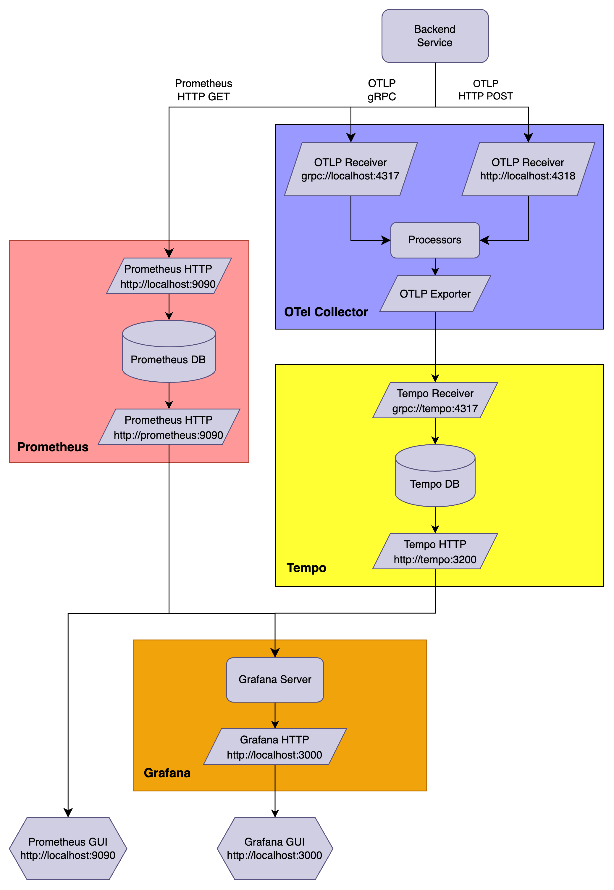

# Observability Demo

## Service Structure

<p align="center">
    
</p>

## Getting Started

1. Start Service

```sh
docker-compose up -d
```

### API

1. Create Task

```sh
curl http://localhost:8080/task -X POST -d '{"description": "Learning Observability"}'
```

2. Get Task List

```sh
curl http://localhost:8080/task
```

3. Get Joke

```sh
curl http://localhost:8080/joke
```

## Kubernetes

### Apply all resources

```sh
kubectl apply -f K8s

# check pod and service
kubectl get pods
kubectl get svc
kubectl logs <your-pod-id>
```

### Test

1. Port forward

```sh
kubectl port-forward svc/observability-demo-tellme-app-service 3000:80
```

2. Open `http://localhost:3000` and click the button on the website.
